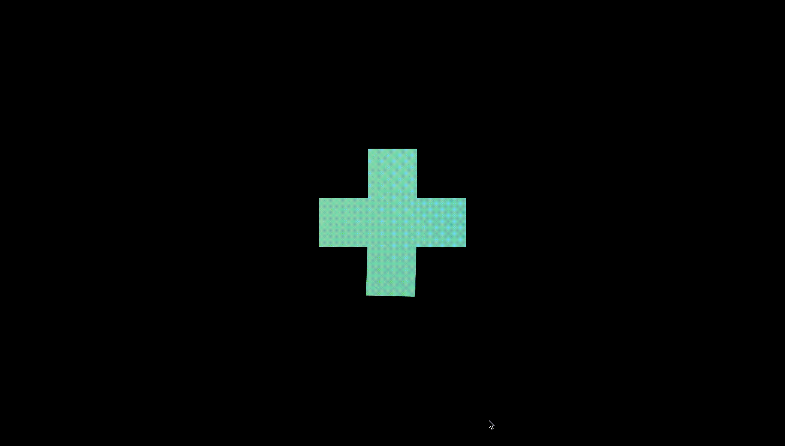

  

## About The Project
3D rotate effect based on Threejs.  

<!-- ## Run Online    -->
<!-- [https://fake3d-effect.netlify.app](https://fake3d-effect.netlify.app)  -->

## Reference
Tutorial https://github.com/akella/RotatingShapes/  

## License
This project is licensed under 

## Contact
* Email:[eric199002@icloud.com](eric199002@icloud.com)
* Twitter:[https://twitter.com/nikoniko600](https://twitter.com/nikoniko600)
<!-- * Repo:[https://github.com/Eric-Schecter/fake3D](https://github.com/Eric-Schecter/fake3D)
* App:[https://fake3d-effect.netlify.app](https://fake3d-effect.netlify.app)  -->